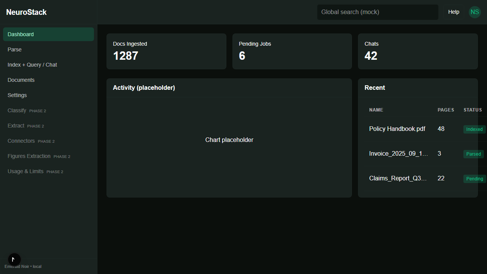

# NeuroStack — Emerald Noir UI (MVP)

NeuroStack is a desktop‑first document intelligence workbench (App Router, TypeScript). This repo ships an MVP UI with mock flows, Playwright E2E, and a minimal CI.

## Highlights
- App Router + TypeScript in `web/`
- Emerald Noir theme, Sidebar + TopNav
- Screens: Dashboard, Parse, Index + Chat, Documents, Settings (mock)
- Playwright E2E (green locally); CI PR build with gated E2E
- Agents stubs + tasks file placeholders

## Quick Start
- Dev: `cd web && npm ci && npm run dev`
- E2E: `cd web && npx playwright install && npm run test:e2e`
- Env: copy `web/.env.example` to `web/.env.local`

Generate/refresh the screenshot tile (optional):
- `cd web && npx playwright install && npm run capture:preview`

## Docs
- Containers (optional image runs): `docs/CONTAINERS.md`
- Security & secrets hygiene: `docs/SECURITY.md`

---

This MVP uses mock data; Phase 2 will wire the OpenAI Agents SDK, parallel agents, and handoffs.
